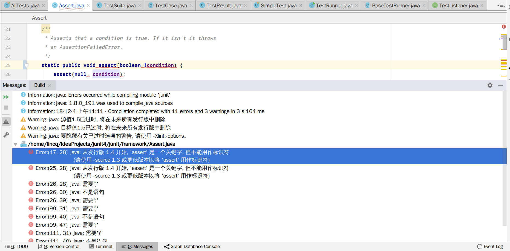

# JT
## 
分支名称-->二级标题
### jdk1.4起，assert是关键字，不能作为变量名称，方法名称（标识符）
    
暂时的解决方式应该是更改jdk版本为1.4以下.但是目前的
Java陷阱之assert关键字(https://blog.csdn.net/LiuShuXiaDeRiLuo/article/details/54668545)

http://www.pascal-man.com/JDK1.3-applet/mqmas/download/download-jdk.shtml
https://www.oracle.com/technetwork/java/javasebusiness/downloads/java-archive-downloads-javase13-419413.html

抽象类可以选择实现其实现的接口方法.
在IDEA中， ctrl + f12 查看类结构视图，若方法中属于在父类或者父接口，则会显示该方法所声明位置的类名称出来.

